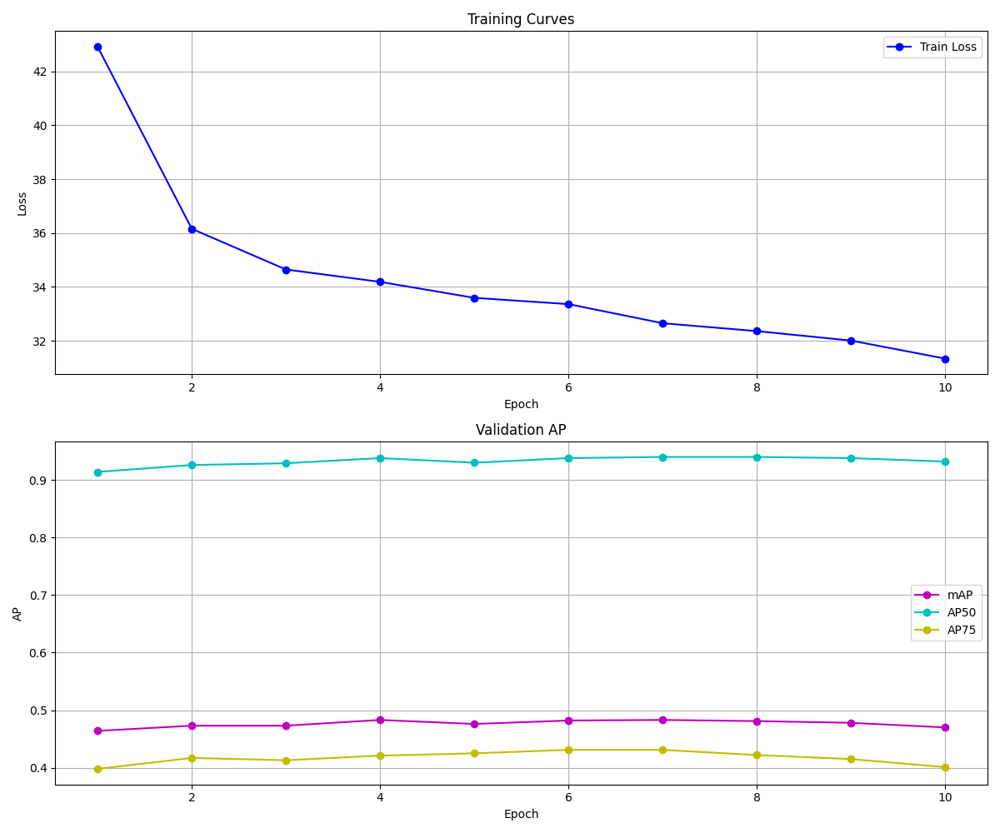
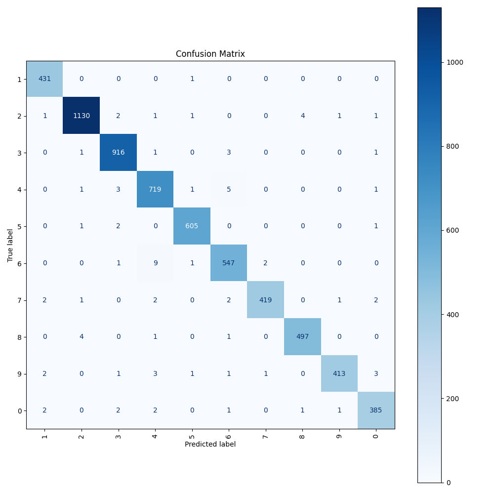
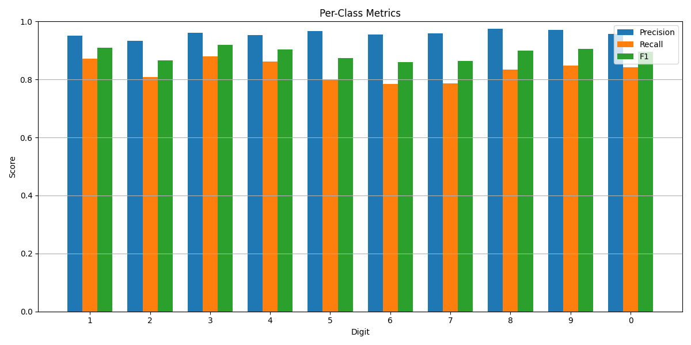
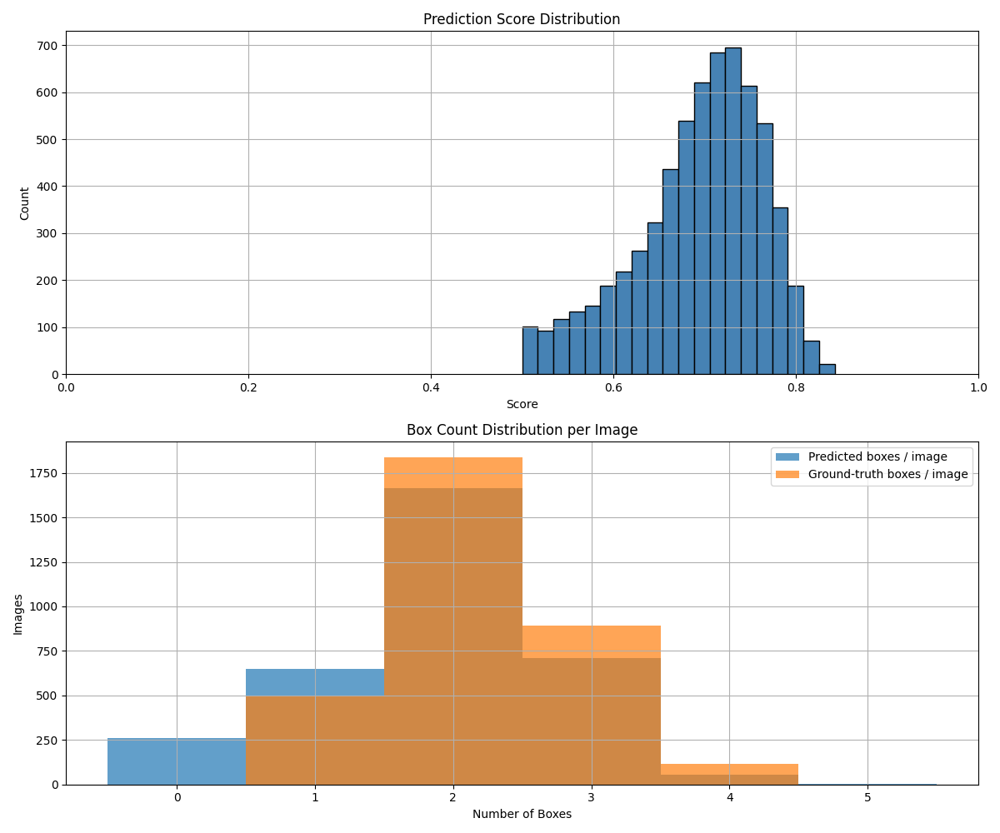

# NYCU Computer Vision 2026 HW2

- Student ID: `414551008`
- Name: `鄧浩培`

## Introduction

This repository contains our solution for NYCU Visual Recognition using Deep Learning 2026 Spring Homework 2.
The homework task is digit detection on RGB images. According to the homework slides, the detector must be a `DETR`-family model with a `ResNet-50` backbone, pretrained weights are allowed for the backbone, and no external data is allowed.

This implementation uses a `Co-DETR / Co-DINO` pipeline on top of `MMDetection` with a `ResNet-50` backbone. In this repo, the active setting keeps only backbone pretraining and does not load a full pretrained Co-DINO detector checkpoint by default.

The project supports:

- Task 1: digit detection
- Task 2: number recognition by sorting detected digits from left to right

The main scripts are:

- [export_svhn_for_codetr.py](./export_svhn_for_codetr.py)
- [create_codetr_svhn_config.py](./create_codetr_svhn_config.py)
- [train.py](./train.py)
- [validation.py](./validation.py)
- [report.py](./report.py)
- [inference.py](./inference.py)

## Environment Setup

Recommended environment from the homework slides:

- Python `3.10` or higher
- A virtual environment is recommended

Install dependencies:

```bash
pip install -r requirements.txt
```

For the Co-DETR path, a compatible full `mmcv` build is also required:

```bash
mim install "mmcv>=2.0.0rc4,<2.2.0"
```

Clone MMDetection so the Co-DETR project modules can be imported:

```bash
git clone https://github.com/open-mmlab/mmdetection external/mmdetection
```

Optional verification:

```bash
python -c "from mmcv.ops import roi_align; print('mmcv ops ok')"
```

If this fails with `No module named 'mmcv._ext'`, the Co-DETR pipeline will not run correctly.

Expected dataset layout:

```text
nycu-hw2-data/
├─ train/
├─ valid/
├─ test/
├─ train.json
└─ valid.json
```

Dataset statistics from the slides:

- Train images: `30,062`
- Validation images: `3,340`
- Test images: `13,068`

## Usage

### Export annotations

The homework labels are already in COCO format, but this repo standardizes them into the layout used by the Co-DETR workflow and also creates the test image-info JSON.

```bash
python export_svhn_for_codetr.py --data-dir ./nycu-hw2-data
```

This creates:

```text
nycu-hw2-data/
└─ codetr_coco/
   └─ annotations/
      ├─ instances_train2017.json
      ├─ instances_val2017.json
      └─ image_info_test-dev2017.json
```

### Generate config

Generate the Co-DETR config used for SVHN training:

```bash
python create_codetr_svhn_config.py ^
  --base-config ./external/mmdetection/projects/CO-DETR/configs/codino/co_dino_5scale_r50_8xb2_1x_coco.py ^
  --data-dir ./nycu-hw2-data ^
  --output ./configs/codetr/co_dino_5scale_r50_svhn.py ^
  --max-epochs 50 ^
  --batch-size 1 ^
  --accumulative-counts 4 ^
  --num-query 300 ^
  --num-dn-queries 50 ^
  --num-co-heads 1 ^
  --save-best coco/bbox_mAP ^
  --max-keep-ckpts 3
```

This config:

- keeps `ResNet-50` as the backbone
- changes the class count to `10`
- keeps only backbone pretraining by default
- writes `load_from = None`

If you intentionally want to fine-tune from a full detector checkpoint again, pass `--load-from` explicitly.

### Training

Single GPU:

```bash
accelerate launch train.py ^
  --repo-root ./external/mmdetection ^
  --config ./configs/codetr/co_dino_5scale_r50_svhn.py
```

Multi-GPU:

```bash
CUDA_VISIBLE_DEVICES=0,1,2,3 accelerate launch --multi_gpu --num_processes 4 ^
  train.py ^
  --repo-root ./external/mmdetection ^
  --config ./configs/codetr/co_dino_5scale_r50_svhn.py
```

Resume training:

```bash
accelerate launch train.py ^
  --repo-root ./external/mmdetection ^
  --config ./configs/codetr/co_dino_5scale_r50_svhn.py ^
  --resume-from ./work_dirs/co_detr_r50_svhn/latest.pth
```

The training output directory is the `work_dir` defined in the config, typically:

```text
./work_dirs/co_detr_r50_svhn/
```

### Validation

Run validation inference and export a structured validation log:

```bash
python validation.py ^
  --repo-root ./external/mmdetection ^
  --config ./configs/codetr/co_dino_5scale_r50_svhn.py ^
  --checkpoint ./work_dirs/co_detr_r50_svhn/best_coco_bbox_mAP_epoch_*.pth ^
  --data-dir ./nycu-hw2-data ^
  --output-dir ./work_dirs/co_detr_r50_svhn_validation
```

This exports files such as:

- `val_pred_<run_name>.json`
- `val_pred_<run_name>.csv`
- `task2_eval_<run_name>.csv`
- `per_class_metrics_<run_name>.txt`
- `<run_name>.log`
- `visualizations_<run_name>/`

Validation summary metrics include:

- `precision`
- `recall`
- `f1`
- `mAP`
- `AP50`
- `AP75`
- `task2_accuracy`

### Report generation

Generate final report figures from one or more validation logs:

```bash
python report.py ^
  --train-log ./work_dirs/co_detr_r50_svhn/20260411_014426.log ^
  --validation-plain ./work_dirs/co_detr_r50_svhn_validation/validation_ens1_plain.log ^
  --output-dir ./work_dirs/co_detr_r50_svhn_report
```

You can also compare multiple validation settings with:

- `--validation-flip`
- `--validation-scale`
- `--validation-both`

Typical report outputs:

- `training_curves.png`
- `confusion_matrix.png`
- `per_class_metrics.png`
- `prediction_diagnostics.png`
- `tta_analysis.png`
- `case_study.png`
- `tta_ranking.csv`
- `report_summary.json`

### Inference

Generate final predictions on the test split:

```bash
python inference.py ^
  --repo-root ./external/mmdetection ^
  --config ./configs/codetr/co_dino_5scale_r50_svhn.py ^
  --checkpoint ./work_dirs/co_detr_r50_svhn/best_coco_bbox_mAP_epoch_*.pth ^
  --data-dir ./nycu-hw2-data ^
  --output-dir ./work_dirs/co_detr_r50_svhn ^
  --score-thr 0.5
```

This script exports:

- `pred.json` for Task 1 submission
- `pred.csv` for Task 2 local analysis

The homework slides specify that the competition submission file must be named `pred.json`, and each item must contain:

- `image_id`
- `bbox`
- `score`
- `category_id`

Bounding boxes use `[x_min, y_min, w, h]`, and `category_id` starts from `1`.

Example with checkpoint ensemble and TTA:

```bash
python inference.py ^
  --repo-root ./external/mmdetection ^
  --config ./configs/codetr/co_dino_5scale_r50_svhn.py ^
  --checkpoint ^
    ./work_dirs/co_detr_r50_svhn/epoch_13.pth ^
    ./work_dirs/co_detr_r50_svhn/epoch_14.pth ^
    ./work_dirs/co_detr_r50_svhn/epoch_15.pth ^
  --data-dir ./nycu-hw2-data ^
  --output-dir ./work_dirs/co_detr_r50_svhn ^
  --score-thr 0.4 ^
  --tta-scales 0.9 1.0 1.1 ^
  --tta-horizontal-flip
```

## Performance Snapshot

### Public Leaderboard


### Training Curves



### Confusion Matrix



### Per-Class Metrics



### Prediction Diagnostics



Final method summary:

- Model: `Co-DETR / Co-DINO` with a `ResNet-50` backbone.
- Dataset: NYCU HW2 digit detection dataset converted to COCO-style annotations.
- Inference: supports checkpoint ensemble and test-time augmentation with scale and horizontal flip.
