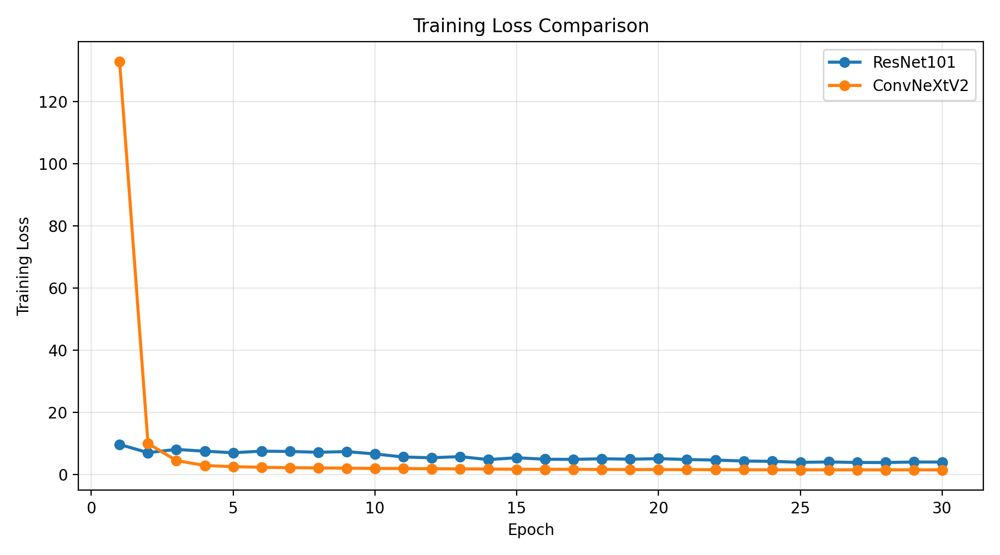
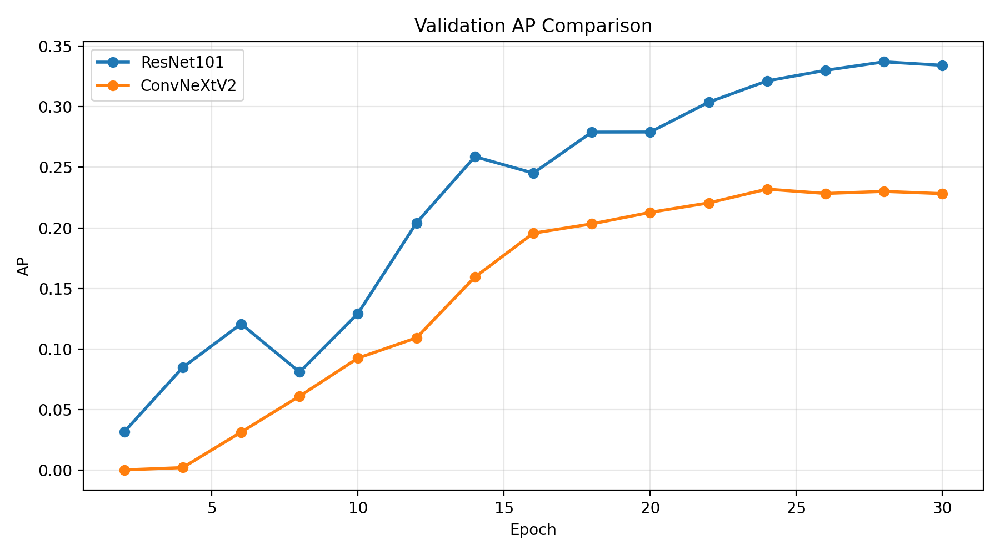
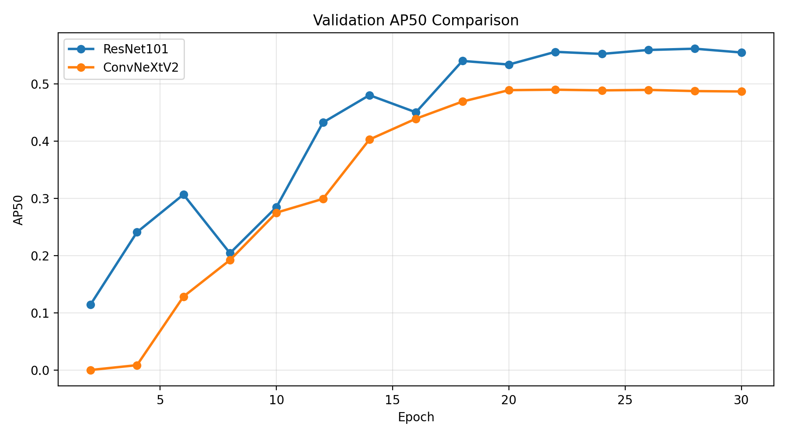
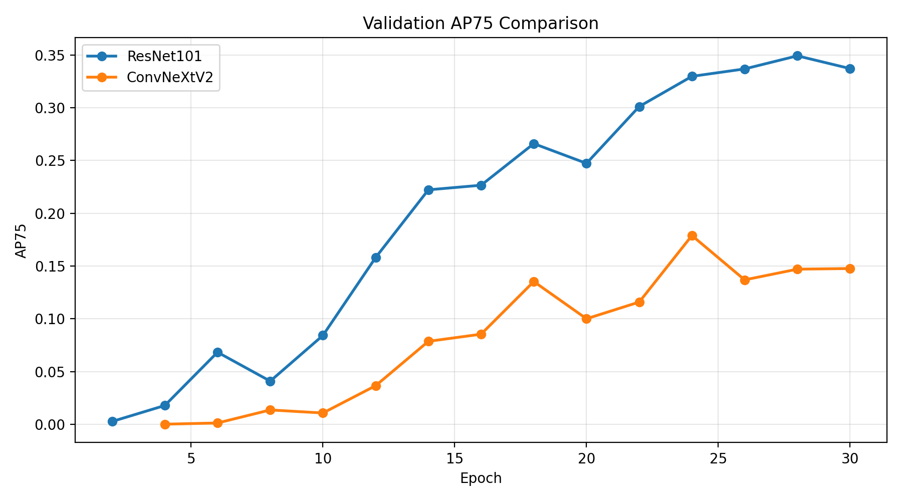
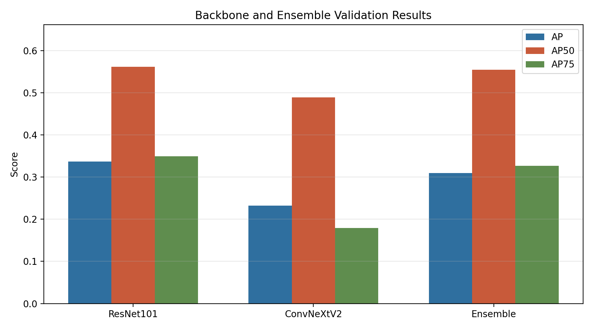
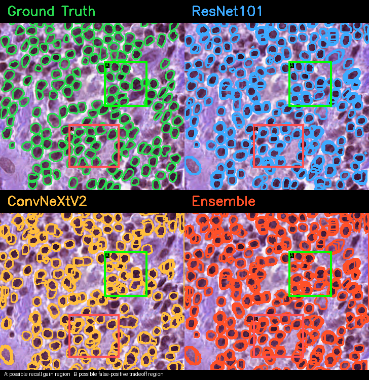
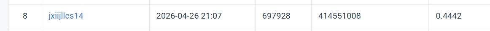

# NYCU Visual Recognition HW3: Cell Instance Segmentation

Student ID: 414551008
Name: 鄧浩培

This repository contains the source code for HW3 instance segmentation on microscopy cell images. The final submission is generated in COCO instance segmentation result format, where each predicted cell instance is represented by an image id, category id, confidence score, bounding box, and RLE-encoded mask.

## Introduction

The task is to segment individual cells from microscopy images across four foreground classes. This is challenging because cell boundaries are often weak, cells may overlap in dense clusters, and the object scale varies across images and classes.

The main method is based on Mask R-CNN with an FPN backbone. I trained and compared two backbone families:

- ResNet101-FPN: a strong residual CNN baseline with stable local validation performance.
- ConvNeXtV2-FPN: a modern convolutional backbone from `timm`, used with torchvision Mask R-CNN heads.

The final additional experiment is a late-fusion ensemble between ResNet101 and ConvNeXtV2. The motivation is not only to improve the score, but also to study whether the two backbones make complementary predictions.

## Environment Setup

Create an environment and install dependencies:

```bash
conda create -n cv python=3.10
conda activate cv
pip install -r requirements.txt
```

Main dependencies:

- PyTorch
- torchvision
- timm
- OpenCV
- pycocotools
- scikit-image
- matplotlib
- numpy

## Dataset Structure

Place the dataset under `data/`:

```text
data/
  train/
    sample_001/
      image.tif
      class1.tif
      class2.tif
      class3.tif
      class4.tif
    sample_002/
      ...
  test_release/
    image_001.tif
    image_002.tif
    ...
  test_image_name_to_ids.json
```

Do not include the dataset or model checkpoints in the final E3 submission zip.

## Usage

### Create Train/Validation Split

```bash
python train.py --data_root data --make_split 0.1
```

### Train ResNet101

```bash
python train.py --mode train \
  --data_root data \
  --epochs 30 \
  --batch_size 1 \
  --accum_steps 8 \
  --lr 1e-4 \
  --backbone resnet101 \
  --val_every 2 \
  --aug 1 \
  --multi_scale \
  --amp \
  --out_dir outputs_resnet101
```

### Train ConvNeXtV2

```bash
python train.py --mode train \
  --data_root data \
  --epochs 30 \
  --batch_size 1 \
  --accum_steps 8 \
  --lr 1e-4 \
  --backbone convnextv2_base \
  --val_every 2 \
  --aug 1 \
  --multi_scale \
  --amp \
  --out_dir outputs_convnextv2
```

### Single-Model Inference

```bash
python train.py --mode infer \
  --data_root data \
  --ckpt outputs_convnextv2/best.pth \
  --backbone convnextv2_base \
  --out_file test-results.json
```

### Ensemble Inference

```bash
python ensemble.py --mode test \
  --data_root data \
  --ckpt_a outputs_resnet101/best.pth \
  --ckpt_b outputs_convnextv2/best.pth \
  --out_file test-results.json
```

The result file must be named `test-results.json` inside the CodaBench submission zip.

### Ensemble Validation and Qualitative Figures

```bash
python ensemble.py --mode val \
  --data_root data \
  --ckpt_a outputs_resnet101/best.pth \
  --ckpt_b outputs_convnextv2/best.pth \
  --eval_out outputs_ensemble/ensemble_eval.json \
  --vis_dir outputs_ensemble/val_vis \
  --num_vis 8
```

This produces validation metrics and qualitative comparison panels:

```text
Ground Truth | ResNet101
ConvNeXtV2   | Ensemble
```

### Generate Validation Plots

```bash
python report.py \
  --resnet_log outputs_resnet101/logs \
  --convnext_log outputs_convnextv2/logs \
  --ensemble_eval outputs_ensemble/ensemble_eval.json \
  --out_dir report_outputs
```

## Results and Analysis

The local validation split and public test result did not rank the models identically. ResNet101 obtained stronger local validation metrics, while ConvNeXtV2 achieved the best public test performance. I interpret this as evidence that the validation split is useful for debugging and training curves, but it may not fully match the test distribution.

The ensemble experiment is motivated by this discrepancy: if two models are favored by different evaluation distributions, their predictions may be complementary. Qualitative validation examples are used to inspect whether ConvNeXtV2 can recover instances or boundaries missed by ResNet101, and whether the ensemble preserves useful predictions from both models.

### Validation Curves









### Final Validation Comparison



### Qualitative Example



### Public Leaderboard Snapshot



## Code Structure

- `datasets.py`: dataset loading, instance mask extraction, augmentation, tiling helpers
- `models.py`: Mask R-CNN model definitions and backbone wrappers
- `train.py`: training, validation, checkpoint saving, and single-model inference entry point
- `inference.py`: single-model test-time augmentation, tiling inference, and COCO result generation
- `ensemble.py`: ResNet101 + ConvNeXtV2 ensemble inference, validation, and qualitative visualization
- `report.py`: validation curve plotting and CSV summary generation
- `utils.py`: COCO evaluation, RLE mask encoding, logging, and shared utilities
